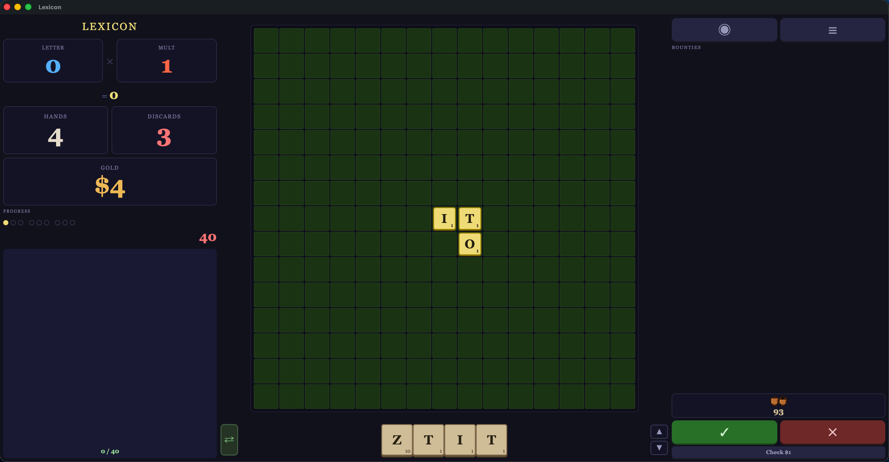

<div align="center">

# Lexicon

<kbd>
  
</kbd>

<h4>A scrabble rouge like game</h4>

[](https://electronjs.org)
[](https://opensource.org)

---

<p align="left">
Description...
</p>

</div>

## Getting Started

Electron is required

```bash
npm install --save-dev electron@42.2.0
```

---

## Running the Program

* **Desktop Application:**
  ```bash
  npm start
  ```
* **Local Web Browser:**
  ```bash
  npx serve .
  ```

---

## Building the Electron App

1. **Install the compiler toolchain:**
   ```bash
   npm install --save-dev @electron-forge/cli
   ```
2. **Execute the build pipeline:**
   ```bash
   npm run make
   ```

> **Output:** Navigate to the `/out` directory to locate your production-ready binaries.
